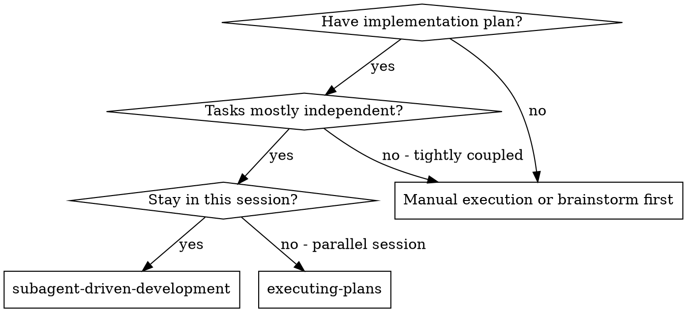
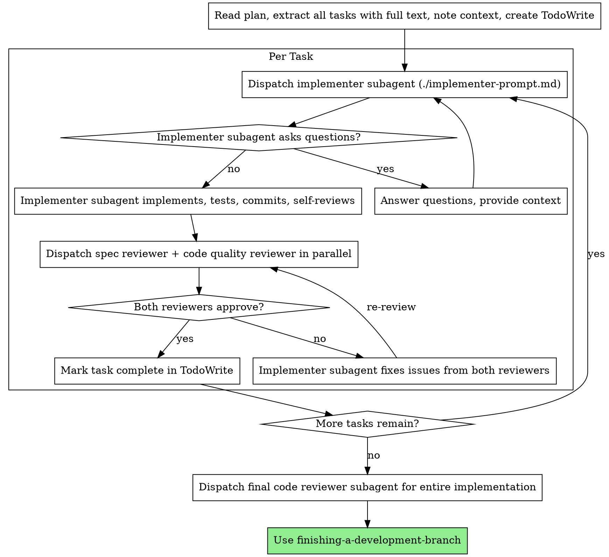

# Subagent-Driven Development

Execute plan by dispatching fresh subagent per task, with parallel review after each: spec compliance and code quality reviewers run simultaneously.

**Why subagents:** You delegate tasks to specialized agents with isolated context. By precisely crafting their instructions and context, you ensure they stay focused and succeed at their task. They should never inherit your session's context or history — you construct exactly what they need. This also preserves your own context for coordination work.

**Core principle:** Fresh subagent per task + parallel review (spec and quality simultaneously) = high quality, fast iteration

**Continuous execution:** Do not pause to check in with your human partner between tasks. Execute all tasks from the plan without stopping. The only reasons to stop are: BLOCKED status you cannot resolve, ambiguity that genuinely prevents progress, or all tasks complete. "Should I continue?" prompts and progress summaries waste their time — they asked you to execute the plan, so execute it.

## When to Use



**vs. Executing Plans (parallel session):**
- Same session (no context switch)
- Fresh subagent per task (no context pollution)
- Parallel review after each task: spec compliance and code quality simultaneously
- Faster iteration (no human-in-loop between tasks)

## The Process



## Handling Implementer Status

Implementer subagents report one of four statuses. Handle each appropriately:

**DONE:** Dispatch spec reviewer and code quality reviewer in parallel.

**DONE_WITH_CONCERNS:** The implementer completed the work but flagged doubts. Read the concerns before proceeding. If the concerns are about correctness or scope, address them before review. If they're observations (e.g., "this file is getting large"), note them and dispatch reviewers in parallel.

**NEEDS_CONTEXT:** The implementer needs information that wasn't provided. Provide the missing context and re-dispatch.

**BLOCKED:** The implementer cannot complete the task. Assess the blocker:
1. If it's a context problem, provide more context and re-dispatch with the same model
2. If the task requires more reasoning, re-dispatch with a more capable model
3. If the task is too large, break it into smaller pieces
4. If the plan itself is wrong, escalate to the human

**Never** ignore an escalation or force the same model to retry without changes. If the implementer said it's stuck, something needs to change.

## Prompt Templates

| Template | Agent | Model | Purpose |
|----------|-------|-------|---------|
| `./implementer-prompt.md` | `focused-builder` | haiku | Implements a well-scoped task, follows TDD, commits, self-reviews |
| `./spec-reviewer-prompt.md` | `code-reviewer` | sonnet | Reads actual code and verifies it matches the spec |
| `./code-quality-reviewer-prompt.md` | `code-reviewer` | sonnet | Reviews code quality, bugs, conventions (sole reviewer — also flags major test/error-handling gaps) |

## Example Workflow

```
[Read plan once, extract all tasks + context, create TodoWrite]

Task 1:
  [Dispatch implementer → answers any questions → implements, tests, commits]
  [Dispatch spec reviewer + code quality reviewer in parallel → both ✅]
  [Mark Task 1 complete]

Task 2:
  [Dispatch implementer → implements, commits]
  [Dispatch spec reviewer + code quality reviewer in parallel]
    spec reviewer → ❌ missing progress reporting
    code quality reviewer → ❌ magic number issue
  [Implementer fixes both → re-dispatch both reviewers in parallel → both ✅]
  [Mark Task 2 complete]

...

[After all tasks: dispatch final code-reviewer → finishing-a-development-branch]
```

## Red Flags

**Never:**
- Start implementation on main/master branch without explicit user consent
- Skip reviews (spec compliance OR code quality)
- Proceed with unfixed issues
- Dispatch multiple implementation subagents in parallel (conflicts)
- Make subagent read plan file (provide full text instead)
- Skip scene-setting context (subagent needs to understand where task fits)
- Ignore subagent questions (answer before letting them proceed)
- Accept "close enough" on spec compliance (spec reviewer found issues = not done)
- Skip review loops (reviewer found issues = implementer fixes = re-review both)
- Let implementer self-review replace actual review (both are needed)
- Move to next task while either reviewer has open issues

**If subagent asks questions:**
- Answer clearly and completely
- Provide additional context if needed
- Don't rush them into implementation

**If reviewer finds issues:**
- Implementer (same subagent) fixes them
- Reviewer reviews again
- Repeat until approved
- Don't skip the re-review

**If subagent fails task:**
- Dispatch fix subagent with specific instructions
- Don't try to fix manually (context pollution)

## Integration

**Required workflow skills:**
- **using-git-worktrees** - Ensures isolated workspace (creates one or verifies existing)
- **writing-plans** - Creates the plan this skill executes
- **requesting-code-review** - Code review template for reviewer subagents
- **finishing-a-development-branch** - Complete development after all tasks

**Subagents should use:**
- **test-driven-development** - Subagents follow TDD for each task

**Alternative workflow:**
- **executing-plans** - Use for parallel session instead of same-session execution
