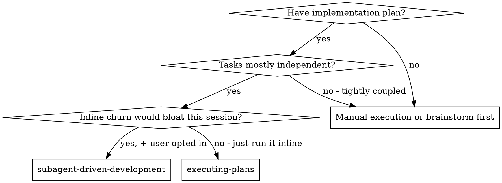
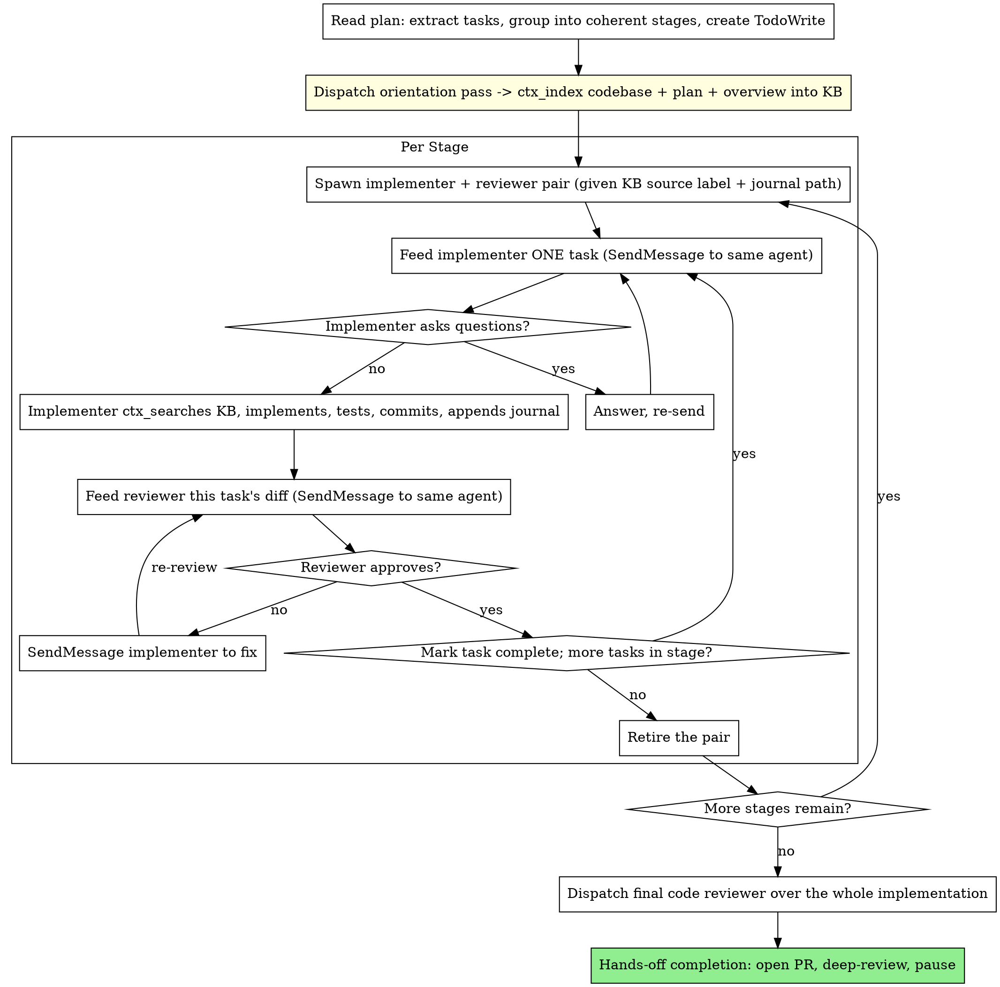

# Subagent-Driven Development

Execute a plan with subagents while paying the codebase-discovery cost **once** and keeping the working churn **off your own context**. One orientation pass indexes the codebase into a shared knowledge base, then a persistent implementer + reviewer pair per coherent stage is fed one task at a time, each querying the KB for only the slice it needs.

**This is opt-in, not the default.** The default post-plan execution path is `executing-plans` (direct in-session, no subagents). Use this skill when the user explicitly asks for subagent-driven execution — typically a plan large enough that doing the work inline would bloat this session's context, yet where you still want isolation between unrelated chunks of work. If the user didn't ask for subagents, use `executing-plans`.

**Why this shape (the middleground):** Fresh-subagent-per-task wastes tokens because every implementer *and* every reviewer boots cold and re-discovers the same code; isolation also makes a stuck subagent expensive to rescue (cold re-dispatch). Doing everything inline avoids re-discovery but dumps all the churn into the session that persists, so every later turn re-sends it. This skill sits between them: a one-time **orientation pass** indexes the codebase into the context-mode KB so no worker re-discovers it, and a **persistent worker per stage** (continued via `SendMessage`) keeps a warm context that lives on the *agent* side, never in yours.

**Core principle:** Index once → persistent implementer+reviewer pair per stage, each `ctx_search`ing the KB for its slice, fed one task at a time → fresh pair per stage for isolation. Discovery is paid once into the KB; churn never lands in your context.

**Continuous execution:** Do not pause to check in between tasks or stages. Execute the whole plan. The only reasons to stop are: a BLOCKED status you cannot resolve, ambiguity that genuinely prevents progress, or all tasks complete. "Should I continue?" prompts waste the human's time — they asked you to execute the plan, so execute it.

**Keep your own context lean — cost compounds.** Everything that lands in *your* context is re-sent on every later turn, so a long run is where token cost balloons. Three habits keep it down: (1) Orientation lives in the KB and per-task churn lives with the subagents, not in your messages — carry forward only each task's verdict, commit SHA, and the `file:line` pointers a later stage needs. (2) Never re-paste a subagent's report, diff, or file dump into your own messages. (3) Never start doing implementation work in your own coordinator context — that defeats the entire point.

**Subagents have context-mode — make them use it.** Every dev agent (`code-explorer`, `focused-builder`, `code-reviewer`, …) carries the `mcp__plugin_context-mode_context-mode__*` tools (verified). Two payoffs the prompts already lean on: (1) **shared orientation** — the codebase is `ctx_index`ed once and each worker `ctx_search`es for its slice instead of re-grepping; (2) **in-sandbox processing** — a worker runs `git diff`, test suites, or greps through `ctx_execute`/`ctx_batch_execute` so the raw output is processed in the sandbox and only the derived result enters *its* context. Note MCP tools are deferred: an agent must call `ToolSearch` (`select:mcp__plugin_context-mode_context-mode__ctx_search`) once to load a schema before the first call.

**Right-size each task before you feed it — you cannot babysit a running subagent.** A `SendMessage` (or `Agent`) call blocks until it returns; there is no way to peek mid-run or course-correct. A worker handed too much grinds for a long time producing an unreviewable diff, and the only way to stop it is a manual interrupt — by which point the time is spent and you may have to discard tangled edits. So feed the worker **one task per message**, never a whole stage at once. Before each message, read the task as if it were the worker's prompt: if it bundles several concerns ("scaffold the dirs *and* retarget the model *and* fix the callers"), or you can't state its goal without "and also", split it and feed the pieces one at a time. A task whose diff would be too large to review in one pass is too large to feed in one message. Splitting up front costs minutes; recovering from a runaway costs the whole run.

## When to Use



**vs. Executing Plans:** same session, but discovery and churn stay with subagents (and the KB) instead of accumulating in yours. Use `executing-plans` for small plans where inline churn is cheap.

## The Process



## Staging the Plan

A **stage** is a small group of tasks that share context — same subsystem, same files, or a natural build sequence (3–5 tasks is typical). Tasks within a stage are fed to one warm worker; unrelated stages get fresh pairs so a messy stage can't pollute the next. If the plan was already sequenced into stages at planning time (see `writing-plans`), use that grouping. If it's a flat task list, group adjacent tasks that touch the same area; put genuinely unrelated tasks in their own stage.

## Orientation Pass (once, up front)

Pick a distinctive **KB source label** for this run, e.g. `orient:<feature-slug>`. Every later `ctx_search` scopes to it so other runs' content doesn't bleed in.

Dispatch **one** orientation agent (`development:code-explorer`, using `./orientation-prompt.md`). It explores the areas the plan touches and `ctx_index`es three things under that label: (1) the relevant codebase paths, (2) the full plan text, (3) a concise architecture + conventions overview it writes as indexed content. No flat orientation file is produced — discovery lives in the KB, queryable per-slice, so a worker reads only what its task needs instead of a whole document. `code-explorer` is the right agent: it's the specialist explorer and now carries `ctx_index`/`ctx_search`; it needs no `Write`.

You do **not** read the indexed content into your own context — you only carry forward the source label and hand it to every worker. Skip this pass only for a plan small enough that a single stage covers it.

> **Subagents can reach the KB — verified.** A dispatched `code-explorer` was confirmed to load and call `ctx_search`/`ctx_index` (after a one-time `ToolSearch` to load the deferred schema). Orientation as a shared KB is therefore real here, not aspirational. This supersedes any earlier "subagents can't reach MCP, use files" guidance.

## Decision Journal (append-only)

The indexed codebase maps the code as it was *before* the run; it goes stale as soon as work starts. The journal carries forward what gets *decided* during the run so a later stage's fresh pair inherits decisions instead of re-deriving them. Keep it as a **file** at `[WORKTREE]/.build-journal.md` — not in the KB — because a fresh stage must inherit *all* prior decisions, and `ctx_search` returns only top-k matches (it could silently miss one); a small file is read in full, reliably.

- **Keep it out of git.** Before stage 1, add it to the worktree-local exclude so no implementer's `git add` commits it: `printf '%s\n' .build-journal.md >> "$(git -C [WORKTREE] rev-parse --git-path info/exclude)"`.
- **Append-only.** Each agent *appends* a short entry; no one rewrites earlier entries, so there's no clobber (implementation subagents run one at a time — never in parallel — so appends don't race). The first implementer creates the file on its first append.
- **Who writes:** only the implementer — it has `Write`/`Bash`; the reviewer is read-only and *cannot* write files. The implementer appends 3–6 bullets after committing each task: decisions made, assumptions taken, gotchas discovered, and anything deferred to a later task ("left retry logic for Task 7"). If the *reviewer* surfaces a cross-cutting concern a later stage must know, it states it in its verdict and you relay it to the next implementer to record.
- **Who reads:** every freshly-spawned stage pair reads the journal at startup (alongside `ctx_search`ing the KB). A warm agent already lived through its own stage's entries, so you don't re-feed them.
- **You never read it into your context** — pass the path; the journal exists for the agents, not the coordinator. Keep entries terse: a decision and its reason, not a narrative.

## Persistent Pair per Stage

For each stage, spawn the pair **once** (a fresh `Agent` call each), then continue them with `SendMessage`:

- **Spawn** an implementer (`development:focused-builder`) and a reviewer (`development:code-reviewer`), each given the KB **source label** and the **journal path**, and told to `ctx_search` the KB for orientation + the files its task touches, and to read the journal. This is the only cold start per stage.
- **Feed one task at a time.** `SendMessage` the implementer a single task (templates in `./implementer-prompt.md`). It `ctx_search`es for specifics, implements, runs tests via `ctx_execute`, commits, appends the journal, returns a status. Then `SendMessage` the reviewer that task's diff range (`./task-reviewer-prompt.md`) — it inspects the diff via `ctx_batch_execute` so the raw diff stays in the sandbox. Because both agents are continued, neither re-orients between tasks.
- **Fix loop stays warm.** If the reviewer finds issues, `SendMessage` the *same* implementer to fix, then `SendMessage` the *same* reviewer to re-check. No context is rebuilt.
- **Retire at stage end.** When the stage's tasks are all approved, drop the pair. The next stage spawns a fresh pair that re-queries the KB and re-reads the journal.

## Handling Implementer Status

Implementer subagents report one of four statuses:

**DONE:** Feed the reviewer this task's diff.

**DONE_WITH_CONCERNS:** Read the concerns first. If they're about correctness or scope, address them (via `SendMessage` to the same implementer) before review. If they're observations ("this file is getting large"), note them and proceed to review.

**NEEDS_CONTEXT:** The worker needs information not provided. `SendMessage` the missing context to the same agent — its warm context is exactly why this is cheap; do not re-dispatch cold.

**BLOCKED:** Assess the blocker, then act on the *same warm agent* wherever possible:
1. Context problem → `SendMessage` more context (or point it at a KB query it missed).
2. Needs more reasoning → escalate the model (a fresh, more capable agent for this task; hand it the KB source label and journal path).
3. Task too large → split it and feed the pieces one at a time.
4. Plan itself is wrong → escalate to the human.

**Never** ignore an escalation or feed the same task again unchanged. If the worker said it's stuck, something must change. **"Too large" is something you catch *before* feeding a task, not only on a BLOCKED report** — an over-reaching worker rarely reports BLOCKED, it just sprawls silently until interrupted. Apply the right-sizing check above before every `SendMessage`.

## Prompt Templates

| Template | Agent | Model | Lifetime | Purpose |
|----------|-------|-------|----------|---------|
| `./orientation-prompt.md` | `development:code-explorer` | sonnet | one-shot | Explores once and `ctx_index`es codebase + plan + overview into the KB under the run's source label |
| `./implementer-prompt.md` | `development:focused-builder` | sonnet | persistent per stage | `ctx_search`es for specifics, implements one fed task, tests via `ctx_execute`, commits, appends journal; continued via `SendMessage` |
| `./task-reviewer-prompt.md` | `development:code-reviewer` | sonnet | persistent per stage | Reviews each task's diff (via `ctx_batch_execute`) for spec + quality; continued via `SendMessage` across the stage |

## Example Workflow

```
[Read plan, group into Stage A (tasks 1–3) and Stage B (tasks 4–5), create TodoWrite]
[Add .build-journal.md to .git/info/exclude; pick KB label orient:my-feature]
[Dispatch code-explorer → ctx_index codebase + plan + overview under orient:my-feature]

Stage A:
  [Spawn implementer + reviewer; both get label orient:my-feature + journal path]
  Task 1: [SendMessage implementer → ctx_searches, commits, appends journal] [SendMessage reviewer → ✅] [mark complete]
  Task 2: [SendMessage implementer → commits, appends journal] [SendMessage reviewer → ❌ missing progress reporting]
          [SendMessage implementer → fixes] [SendMessage reviewer → ✅] [mark complete]
  Task 3: [SendMessage implementer → commits, appends journal] [SendMessage reviewer → ✅] [mark complete]
  [Retire the pair]

Stage B:
  [Spawn fresh pair → they ctx_search orient:my-feature + read Stage A's journal entries, inheriting its decisions]
  ...

[After all stages: final code reviewer → hands-off completion → open PR → deep-review → pause]
```

## Completion (hands-off)

After the final stage's review passes, complete hands-off — same as `executing-plans` Step 3. Do not present an interactive integration menu:

1. **Verify the full suite.** Run the project's test command; fix failures or stop and report. No PR on a red suite.
2. **Confirm the journal never got committed.** Run `git -C [WORKTREE] log --all --name-only -- .build-journal.md` — it must return nothing. If it slipped into a commit (e.g. an explicit `git add` bypassed the exclude), remove it from history before the PR. The journal is run-scoped scaffolding, not a deliverable. (The KB needs no cleanup — it's outside the repo; purge it later with `ctx_purge` if desired.)
3. **Open a PR, hands-off.** Invoke `creating-pull-requests` to push the branch and open the PR.
4. **Review.** Invoke `deep-review` for the pre-merge review.
5. **Pause.** Report the PR link and review findings, then STOP. The human decides final integration; `finishing-a-development-branch` runs only if they then choose local merge / discard / cleanup.

## Red Flags

**Never:**
- Start implementation on main/master branch without explicit user consent
- Skip the orientation pass on a multi-stage plan (every worker then re-discovers the codebase — the exact waste this skill exists to remove)
- Let workers re-grep the whole codebase when the KB already holds it — point them at `ctx_search` with the run's source label
- Pull large command output (diffs, test logs, greps) into a subagent's context raw instead of processing it via `ctx_execute`/`ctx_batch_execute`
- Put the decision journal in the KB instead of a file (`ctx_search` returns top-k and can miss a decision; a fresh stage must inherit *all* of them)
- Skip the decision journal across stages (a fresh stage pair then re-derives or contradicts decisions earlier stages already made)
- Let an agent rewrite or edit earlier journal entries (append-only — overwriting loses the very history later stages need)
- Commit the journal to the branch (add it to the worktree-local git exclude before any task runs; it's run-scoped scaffolding)
- Read the indexed content, the journal, or any task's churn into your *own* context (carry forward only the KB label, journal path, verdicts, SHAs, and `file:line`)
- Feed a worker more than one task in a single message (you can't interrupt a synchronous call; an oversized message can only be stopped by a manual interrupt after the time is wasted)
- Spawn a *fresh* agent for the next task within a stage instead of continuing the warm one via `SendMessage` (that reintroduces re-discovery)
- Cold-re-dispatch a stuck worker when `SendMessage`-ing context into its warm context would do
- Skip the per-task review (it covers both spec compliance and code quality)
- Proceed with unfixed issues, or move to the next task while the reviewer has open issues
- Make a subagent read the plan file (it's in the KB — tell it to `ctx_search` the label)
- Re-paste a subagent's full report, diff, or file dump into your own messages

**If subagent asks questions:** answer clearly and completely via `SendMessage`; don't rush it into implementation.

**If reviewer finds issues:** the same warm implementer fixes; the same warm reviewer re-checks; repeat until approved.

## Integration

**Required workflow skills:**
- **using-git-worktrees** - Ensures isolated workspace (creates one or verifies existing); the journal lives here
- **writing-plans** - Creates the plan this skill executes; its stage sequencing feeds the staging step
- **requesting-code-review** - Code review template for reviewer subagents
- **creating-pull-requests** - Opens the PR automatically in hands-off completion
- **deep-review** - Pre-merge review run automatically before the pause
- **finishing-a-development-branch** - Only when the user explicitly chooses local merge / discard / cleanup after the pause

**Subagents should use:**
- **test-driven-development** - Implementer follows TDD for each task
- **context-mode** - Workers `ctx_index`/`ctx_search` the shared KB and process heavy output in-sandbox via `ctx_execute`

**Alternative workflow:**
- **executing-plans** - The default; use for small plans where inline churn is cheap
