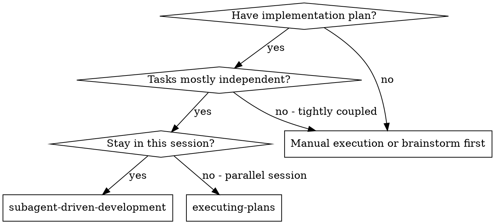
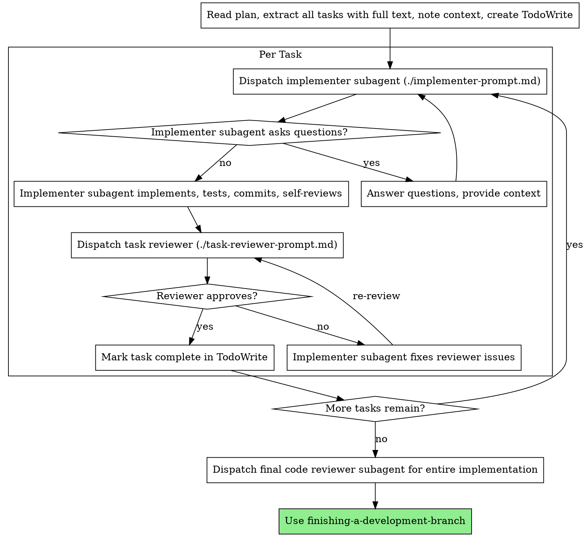

# Subagent-Driven Development

Execute plan by dispatching fresh subagent per task, with a combined spec-compliance and code-quality review after each.

**Why subagents:** You delegate tasks to specialized agents with isolated context. By precisely crafting their instructions and context, you ensure they stay focused and succeed at their task. They should never inherit your session's context or history — you construct exactly what they need. This also preserves your own context for coordination work.

**Core principle:** Fresh subagent per task + one combined review (spec and quality in a single pass) = high quality, fast iteration

**Continuous execution:** Do not pause to check in with your human partner between tasks. Execute all tasks from the plan without stopping. The only reasons to stop are: BLOCKED status you cannot resolve, ambiguity that genuinely prevents progress, or all tasks complete. "Should I continue?" prompts and progress summaries waste their time — they asked you to execute the plan, so execute it.

**Keep context lean — cost compounds.** Every subagent report lands in your context and is re-sent on every later turn, so a long run with verbose returns is where token cost balloons. Two habits keep it down: (1) the prompt templates and agent definitions already return status + findings + `file:line`, not pasted code or logs — don't ask subagents for more, and don't re-paste their reports into your own messages. Carry forward only the verdict, the commit SHA, and the pointers you need for later tasks. (2) Execution itself stays cheapest in fresh subagent context, which is exactly why each task gets its own subagent — never start doing the implementation work in your own coordinator context. If a plan is large enough that even coordination context grows heavy, that plan should have been sequenced into stages at planning time (see writing-plans).

**Right-size each task before you dispatch it — you cannot babysit a running subagent.** An `Agent` call blocks until it returns; there is no way to peek at progress or course-correct mid-run. A focused-builder handed too much grinds for a long time producing an unreviewable diff, and the only way to stop it is for someone to manually interrupt — by which point the wasted time is already spent and you may have to discard or untangle its sprawling edits. The plan should already size tasks, but **you are the last checkpoint.** Before dispatching, read the task as if it were the subagent's prompt. If it bundles several concerns ("scaffold the dirs *and* retarget the model *and* update the templates *and* fix the callers"), spans many unrelated files, or you can't state its goal without "and also" — split it into focused sub-tasks and dispatch them one at a time. A task whose diff would be too large to review in one pass is too large to implement in one subagent. Splitting up front costs minutes; recovering from a runaway costs the whole run. If you dispatch via a background task instead, set a tight `timeout` (not 30+ minutes) so a stuck agent surfaces instead of blocking indefinitely.

## When to Use



**vs. Executing Plans (parallel session):**
- Same session (no context switch)
- Fresh subagent per task (no context pollution)
- Combined review after each task: spec compliance and code quality in one pass
- Faster iteration (no human-in-loop between tasks)

## The Process



## Handling Implementer Status

Implementer subagents report one of four statuses. Handle each appropriately:

**DONE:** Dispatch the task reviewer.

**DONE_WITH_CONCERNS:** The implementer completed the work but flagged doubts. Read the concerns before proceeding. If the concerns are about correctness or scope, address them before review. If they're observations (e.g., "this file is getting large"), note them and dispatch the task reviewer.

**NEEDS_CONTEXT:** The implementer needs information that wasn't provided. Provide the missing context and re-dispatch.

**BLOCKED:** The implementer cannot complete the task. Assess the blocker:
1. If it's a context problem, provide more context and re-dispatch with the same model
2. If the task requires more reasoning, re-dispatch with a more capable model
3. If the task is too large, break it into smaller pieces
4. If the plan itself is wrong, escalate to the human

**Never** ignore an escalation or force the same model to retry without changes. If the implementer said it's stuck, something needs to change.

**"Too large" is something you catch *before* dispatch, not only on a BLOCKED report.** A subagent that over-reaches rarely reports `BLOCKED` — it just keeps sprawling silently until someone interrupts it. By then the cost is sunk. So don't rely on the status report to surface an oversized task: apply the right-sizing check above at dispatch time, and when an interrupted or over-reaching subagent *is* the problem, re-split into focused sub-tasks (each a single coherent concern) rather than re-dispatching the same broad task and hoping it goes faster.

## Prompt Templates

| Template | Agent | Model | Purpose |
|----------|-------|-------|---------|
| `./implementer-prompt.md` | `development:focused-builder` | sonnet | Implements a well-scoped task, follows TDD, commits, self-reviews |
| `./task-reviewer-prompt.md` | `development:code-reviewer` | sonnet | Verifies spec compliance and code quality in one pass over the task's diff (sole reviewer — also flags major test/error-handling gaps) |

## Example Workflow

```
[Read plan once, extract all tasks + context, create TodoWrite]

Task 1:
  [Dispatch implementer → answers any questions → implements, tests, commits]
  [Dispatch task reviewer → ✅]
  [Mark Task 1 complete]

Task 2:
  [Dispatch implementer → implements, commits]
  [Dispatch task reviewer → ❌ spec: missing progress reporting; quality: magic number]
  [Implementer fixes both → re-dispatch task reviewer → ✅]
  [Mark Task 2 complete]

...

[After all tasks: dispatch final development:code-reviewer → finishing-a-development-branch]
```

## Red Flags

**Never:**
- Start implementation on main/master branch without explicit user consent
- Skip the per-task review (it covers both spec compliance and code quality)
- Proceed with unfixed issues
- Dispatch multiple implementation subagents in parallel (conflicts)
- Make subagent read plan file (provide full text instead)
- Skip scene-setting context (subagent needs to understand where task fits)
- Ignore subagent questions (answer before letting them proceed)
- Accept "close enough" on spec compliance (reviewer found spec issues = not done)
- Skip review loops (reviewer found issues = implementer fixes = re-review)
- Let implementer self-review replace actual review (both are needed)
- Move to next task while the reviewer has open issues
- Dispatch a task that bundles several concerns or spans many unrelated files without splitting it first — you can't interrupt a synchronous subagent mid-run, so an oversized task can only be stopped by a manual interrupt after the time is already wasted
- Re-dispatch the same broad task after a runaway/interrupt instead of re-splitting it into focused sub-tasks
- Re-paste a subagent's full report, diff, or file dump into your own messages (carry forward only the verdict, commit SHA, and file:line pointers — the rest just inflates every later turn)

**If subagent asks questions:**
- Answer clearly and completely
- Provide additional context if needed
- Don't rush them into implementation

**If reviewer finds issues:**
- Implementer (same subagent) fixes them
- Reviewer reviews again
- Repeat until approved
- Don't skip the re-review

**If subagent fails task:**
- Dispatch fix subagent with specific instructions
- Don't try to fix manually (context pollution)

## Integration

**Required workflow skills:**
- **using-git-worktrees** - Ensures isolated workspace (creates one or verifies existing)
- **writing-plans** - Creates the plan this skill executes
- **requesting-code-review** - Code review template for reviewer subagents
- **finishing-a-development-branch** - Complete development after all tasks

**Subagents should use:**
- **test-driven-development** - Subagents follow TDD for each task

**Alternative workflow:**
- **executing-plans** - Use for parallel session instead of same-session execution
